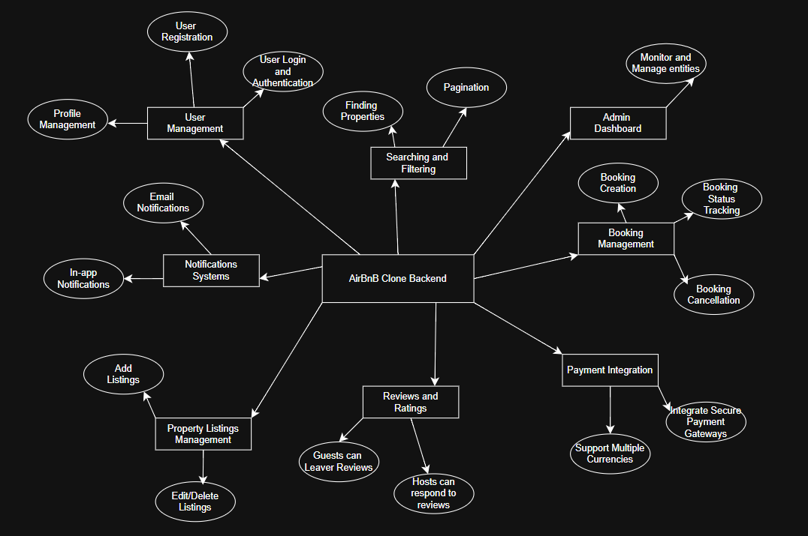

# Airbnb Clone Backend - Features and Functionalities

This document outlines the core features and backend requirements for the Airbnb Clone project.  
It is divided into **Core Functionalities**, **Technical Requirements**, and **Non-Functional Requirements**.

---

## 🏗 Core Functionalities

### 1. User Management
- Register as guest or host
- Secure login (email/password, OAuth with Google/Facebook)
- Profile updates (photo, contact info, preferences)

### 2. Property Listings Management
- Add new property listings (title, description, location, price, amenities, availability)
- Edit or delete existing listings

### 3. Search and Filtering
- Search properties by location, price range, guest capacity, and amenities
- Pagination for large results

### 4. Booking Management
- Create new bookings with date validation
- Cancel bookings (guest/host)
- Booking status tracking (pending, confirmed, cancelled, completed)

### 5. Payment Integration
- Secure payment gateway (Stripe, PayPal)
- Guest upfront payment
- Host payout after booking completion
- Multi-currency support

### 6. Reviews and Ratings
- Guests leave reviews and ratings
- Hosts respond to reviews
- Reviews linked to bookings

### 7. Notifications System
- Email and in-app notifications for bookings, cancellations, and payments

### 8. Admin Dashboard
- Monitor/manage users, listings, bookings, payments

---

## ⚙️ Technical Requirements
- Relational database (PostgreSQL/MySQL) with tables: Users, Properties, Bookings, Reviews, Payments
- RESTful API design with proper HTTP methods & status codes
- JWT authentication + role-based access control
- File storage for images (AWS S3/Cloudinary)
- Third-party email service (SendGrid/Mailgun)
- Global error handling and logging

---

## 🚀 Non-Functional Requirements
- **Scalability:** modular architecture, horizontal scaling
- **Security:** encryption, firewalls, rate limiting
- **Performance:** caching with Redis, optimized queries
- **Testing:** unit, integration, automated API tests

---

## 📊 Features Diagram

