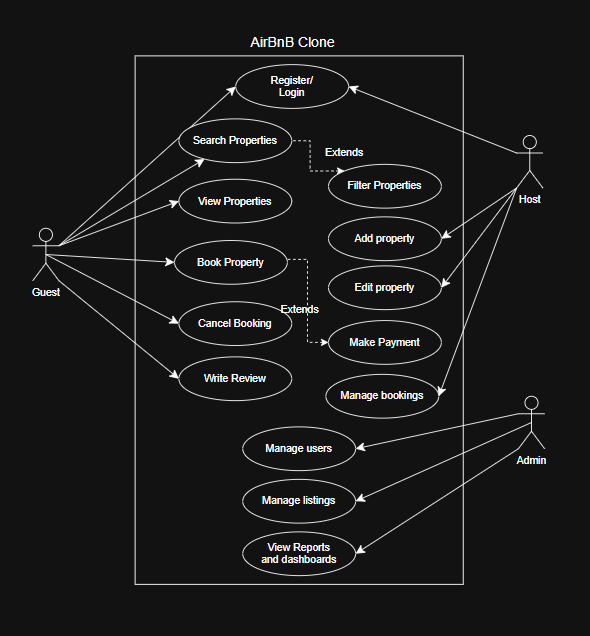

# Use Case Diagram – Airbnb Clone Backend

## 📌 Objective
This use case diagram illustrates the **key interactions** between the system and its primary actors: **Guest, Host, and Admin**.  
It captures the essential functionalities required for the backend of an Airbnb-like application.

---

## 👤 Actors
- **Guest** – A user who can search, book, pay for properties, and leave reviews.  
- **Host** – A user who can list properties, manage bookings, and respond to reviews.  
- **Admin** – A system administrator who oversees users, listings, bookings, and payments.  

---

## 🎯 Essential Use Cases
### Guest
- Register / Login  
- Search Properties  
- View Property Details  
- Book Property (includes Payment)  
- Cancel Booking  
- Write Review  

### Host
- Register / Login  
- Add Property Listing  
- Edit/Delete Property Listing  
- Manage Bookings  
- Respond to Reviews  

### Admin
- Manage Users  
- Manage Listings    
- View Reports / Dashboard  

---

## 🖼️ Diagram
The use case diagram is provided below:

---

## ✅ Conclusion
This diagram provides a high-level overview of system interactions.  
It will guide backend development by ensuring all essential functionalities for Guests, Hosts, and Admins are covered.

